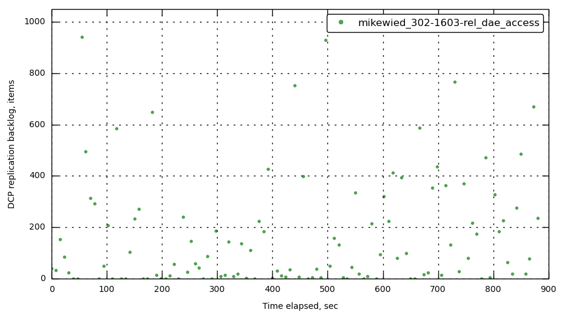
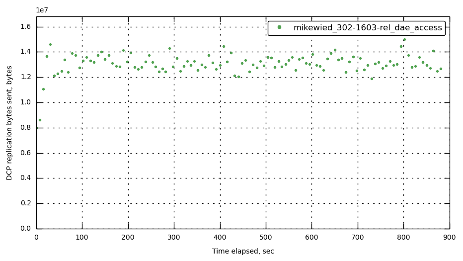
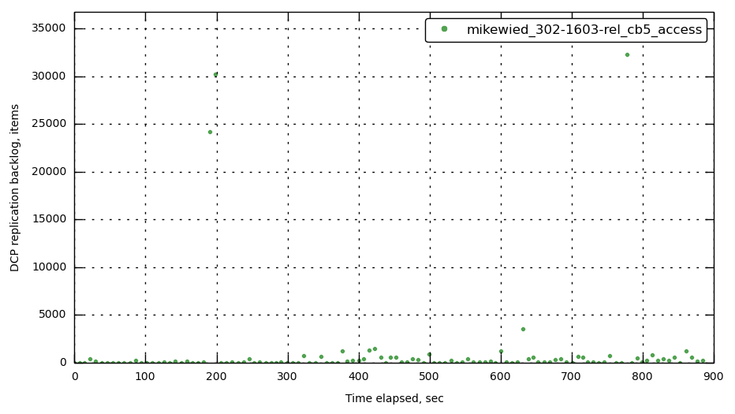
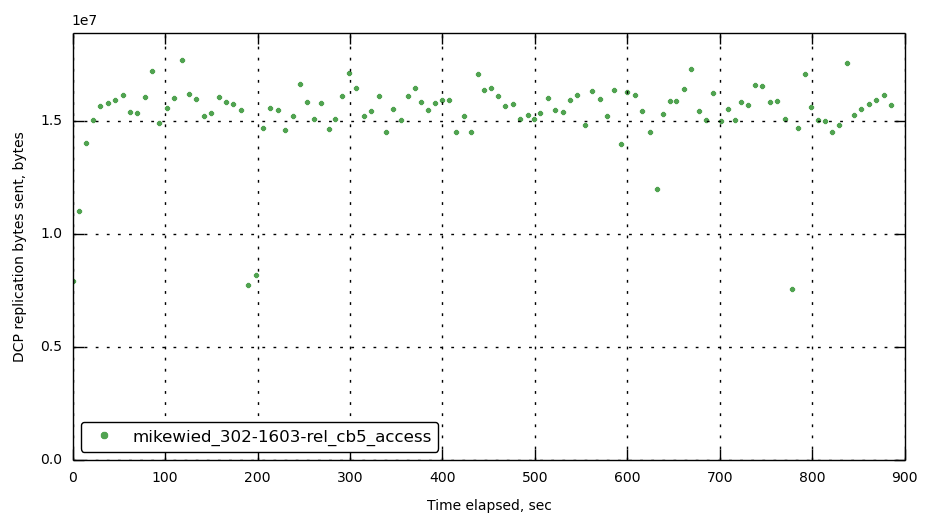
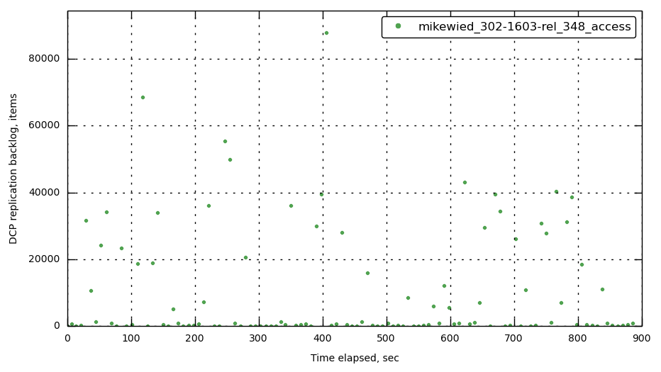
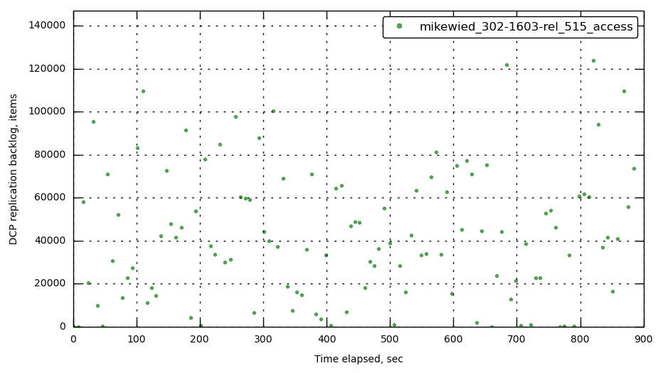
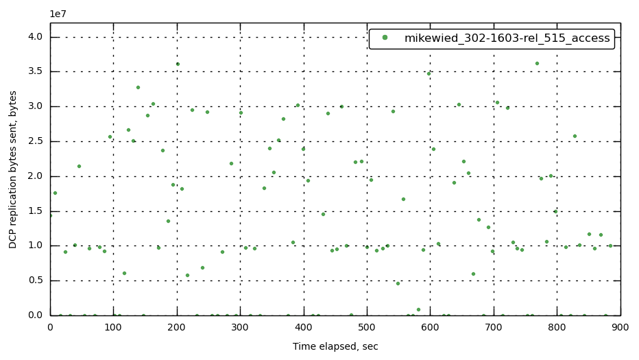

#Replication Only Results

**Test Specifiction:**

* Cluster Size: 2 Nodes
* Value Size: 1KB
* Run Time: 15 minutes
* Bucket Size: 2GB
* Items in Cluster: 1,000,000

###10,000 sets/sec

###12,000 sets/sec

###13,000 sets/sec

###15,000 sets/sec

