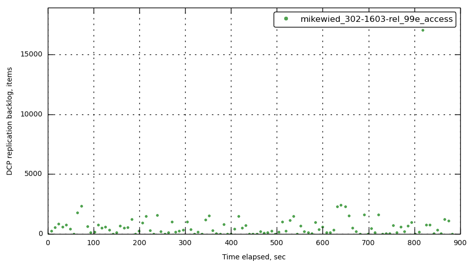
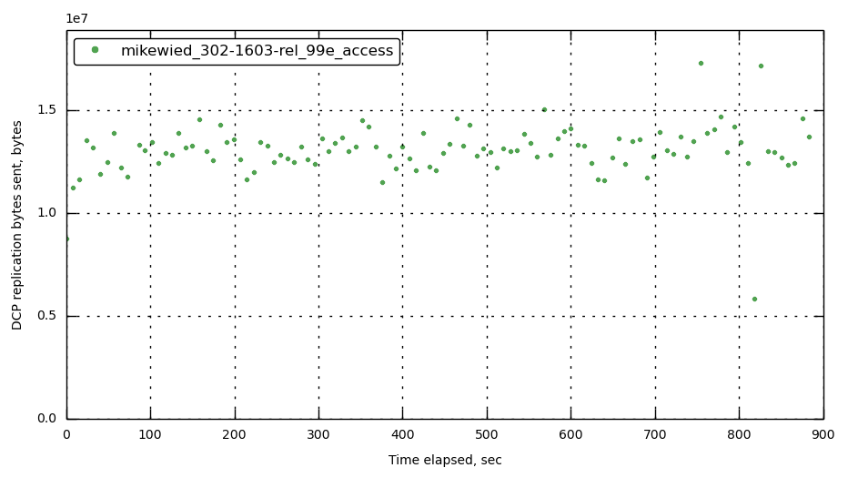
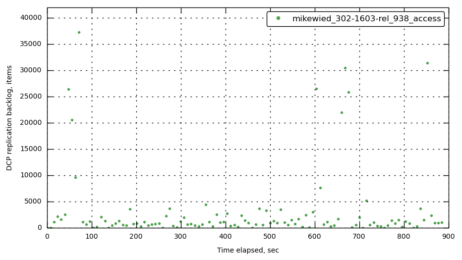
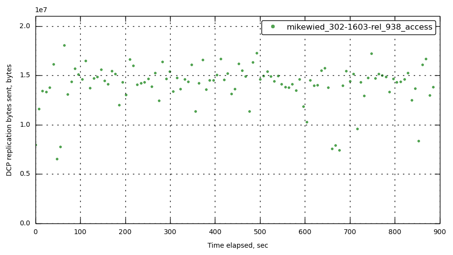

#Replication With Views and XDCR Results

**Test Specifiction:**

* Cluster Size: 2 Nodes
* Value Size: 1KB
* Run Time: 15 minutes
* Bucket Size: 2GB
* Items in Cluster: 1,000,000

###10,000 sets/sec

###11,000 sets/sec

