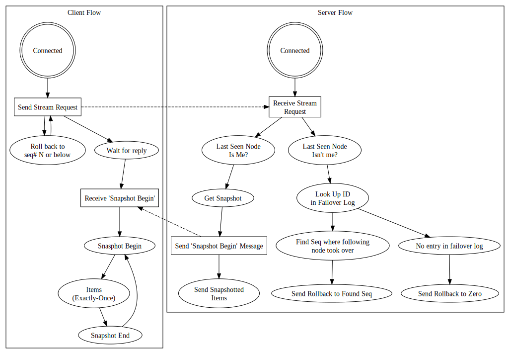

# Introduction

## Motivation

The current replication protocol for Couchbase was designed for the
needs of a clustered key-value store. As we've added functionality like
indexing and cross datacenter replication, as well as integration with
other systems, like Hadoop and ElasticSearch, ... something something
(copy edit me help plz)

## Scope

The new intra-cluster replication protocol should provide an ordering of
events in a partition, even across cluster topology changes. This allows
a client of the protocol to correctly resume from where it left off,
avoiding unnecessary network load or index computation.

The protocol should also specify how to handle cases where components in
the cluster disagree on the history events in a partition.

## Terminology

Partition (sometimes called vBucket)
:   Couchbase splits the key space into a fixed amount of partitions,
    usually 1024. That is, keys are deterministically assigned to a
    partition, and partitions are assigned to nodes to balance load
    across the cluster.

Sequence Number
:   Each data event (update, set, delete, etc.) that occurs is assigned
    a number that can be used to order that event against other events
    within the same partition. This does *not* give a cluster-wide
    ordering of events, but it does enable processes watching events on
    a partition to resume where they left off after a disconnect.

Partition Version
:   A UUID, Sequence Number pair associated with a partition. A new
    version is assigned to a partition by its new master node any time
    there may have been a history branch, with the sequence number being
    the highest snapshotted sequence seen in that partition by its
    master node.

History Branch
:   Whenever a node becomes the master node for a partition, if it was
    not the farthest ahead of all processes watching events on that
    partition and starts taking mutations, it is possible it will reuse
    sequence numbers that other processes have already seen on this
    partition.

## Message Types

### Stream Request

A client is requesting the event stream for a partition since some
sequence. It sends the known versions of the partition, with the most
recent one it was connected to first.

If the client's most recently connected-to version for the partition is
*not* the current one on the server, the server will determine how far
the client must roll back to sync up with the now current version of
this partition.

Clients that try to stay connected as often as possible likely only need
to keep the most recent partition version for the partitions they are
watching, whereas clients that connect rarely (for example, a backup
process), may want to keep several partition versions, which allows for
finding a better rollback point than zero when multiple history branches
have occured since the last time the client was connected.

#### Fields

*   Partition to stream from
*   Sequence number to stream since
*   Client's known versions for the partition
*   Does the client want the entire version log?

### Stream Request Response (ROLLBACK)
 
There has been a history branch since the client was last connected, so
the server sends it sequence number.

The client must roll back data such that it's state is as of a snapshot
that ends on a sequence *less than or equal* to this sequence.

#### Fields

*   Sequence number to roll back (at least) to.

### Stream Request Response (OK)

There was no history branch since the client last connected, or the
client is requesting the entire history (change since sequence zero).
The server will now start streaming the requested items.

#### Fields

*   Current partition version, or all the versions the server knows
    about if the client requested them.
*   Stream identifier for this partition stream

### Partition stream - Snapshot Begin

This message is sent to notify the snapshot the items that follow are in
a snapshot, meaning that only the most recent update for any given key
within the snapshot window.

#### Fields

*   Sequence number at which this snapshot ends

### Partition stream - Mutation

An item update, always has a key, may represent a delete, in which
case there will not be a value.

#### Fields

*   Sequence number
*   Key
*   Value?
*   Deleted?
*   ... what other metadata?

### Partition stream - Snapshot End

This message will be sent after all items in a snapshot have been sent,
to let the client know the snapshot is complete.

## Behaviors

### The failover log

When a replica requests partition streams it should ask the master for
a list of all of versions of that partition the master node knows about.

The replica will keep that list in case it becomes master and needs to
send the version history to other replicas in the future.

When a node takes over as master for a partition, if it creates a new
version for that partition (because it was not able to take over
cleanly), it adds an entry to the partition version list that it
maintains. This is also called the failover log, since it will have an
entry for each failover, or unclean takeover, event.

### Finding a rollback point

When a client connects and has not been most recently connected to the
current version of the partition it is requesting, the server should
search for the provided version in its failover log. If it finds an
entry for that version, it should send a message to the client
requesting it roll back *at least to* the sequence that begins the
version *after* this version in the failover log.

If none of the clients known versions can be found in the server's
failover log, it must request that the client roll back to zero, that
is, discard all its data for this partition and start from scratch.

## Flow

