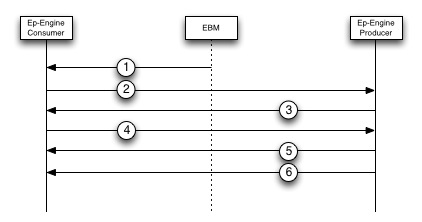

#Rebalance

This document intends to provide a detailed step by step description of the messages and commands that will be used to move a VBucket from one node to another using the UPR protocol. A VBucket move consists of an initial connection handshake, adding/removing VBucket Streams, getting the new VBucket up to date with respect to the old VBucket, and the actual VBucket takeover. Each of these phases will be detailed in the sections below.

###Initial Stream Handshake

1. The EBucketMigrator will create a connection between itself and the consumer as well as a connection between itself and the producer. It will do this by sending an “open connection” message that contains a name for the connection which will be used for stats and debugging (It is advised that the consumer and producer connections have the same name in order to be able to easily see information for both sides of the connection). If a connection with the name given already exists then that connection will be closed immediately. A closed connection on the consumer side means any incoming messages to the old connection will be nack’ed (and not processed). On the producer side a closed connection will cause any structures used for transmitting data to be torn down. As a result the connection name will be unique and shared between both the producer and consumer sides of the connection. This will enforce that the connection name is associated with one and only one connection.
2. The EBucketMigrator sends a "Add Stream" message down the consumer side of the UPR connection. The “Add Stream” message contains the VBucket ID that the consumer needs to start a stream for and does not return a response until the stream handshake is complete. As a result the EBucketMigrator should expect an out of order response for this message, but will be able to match the response with the request by looking at the opaque. Since the requests are out of order the EBucketMigrator can pipeline these messages and they will be processed parallely by ep-engine.
3. The consumer side will send out a Stream Request message for the VBucket that it wants to start a stream for. Each Stream Request message will contain a high sequence number/vbucket uuid pair that tells the producer where the consumer last left off in the data stream. These messages will be sent directly back to the EBucketMigrator process and should be forwarded to the producer side of the connection.
The producer will respond to each Stream Request message with either an OK response or a Rollback response. If the response is a Rollback message then the stream behavior will resume at step 3, but if an OK response is received then jump to step 5.
4. Based on the high sequence number/vbucket uuid pair that was sent in the Stream Request message the producer has decided that the consumer must rollback it's data to a specific sequence number. The producer will respond to the consumer that this needs to be done by sending a Rollback message that contains the sequence number that the consumer should roll back to.
5. When the consumer receives a Rollback message it will rollback to at least the sequence number specified by the producer. The consumer will then send a new Stream Request message back to the producer with it's updated high sequence number/vbucket uuid.
It is possible if there is a failover between steps 3 and 4 that the consumer will need to rollback again. This should be rare, but if it does happen then jump back to step 3.
6. Since the consumer has rolled back its state and is in sync with the producer the consumer will receive an OK message which will contain the failover log of the producer. The consumer should persist and overwrite its failover log with the one from the producer.
At this point the request-response pattern for a stream will change. During the handshake the consumer made all requests, but post-handshake the producer will make all requests.
7. The “Add Stream” message returns a response back to the EBucketMigrator signifying that the VBucket has been successfully added to the connection and that the stream has started.
8. The producer will now begin to send mutations to the consumer.

###Closing Streams

To close a VBucket Stream the EBucketMigrator will send a “Close Stream” message containing the VBucket ID of the stream to close to both the consumer and producer sides of the UPR connection. The consumer will immediately close it’s connection and refuse to process any other message that may already be on the wire for that stream. The producer will place an end stream message into it’s send queue and mark the connection dead. All Close Stream messages will return responses to the EBucketMigrator immediately and the response can be mapped to the request by using the opaque field. See the Initial Stream Handshake section above for details on how to choose an opaque.

###Moving Data

In order to bring the new VBucket up to date with respect to the current active VBucket we must monitor the UPR stream for certain events to take place. Figure 3 below shows each of these events and how they can be monitored will be described below.

1. The first event that ns_server needs to see take place is for the new VBucket to be close to being up to date. NS_Server will be able to find out about this event by polling "stats vbucket-takeover ". This stat will provide an estimate of how much more data needs to be sent over the given stream for a given vbucket. If there are less than 1000 items that still need to be sent the NS_Server can assume that the new VBucket is almost up to date with respect to the old VBucket. (Note that in the initial implementation we will consider a replication as almost up to date based on item counts. In the future it would be better to do this based on the amount of bytes left to send. Any improvements in this area will be considered an optimization and out of scope for the initial design.)
2. When doing a rebalance we want to avoid the possibility of massive data loss immediately after a VBucket move. This can happen if we don’t persist everything to disk before starting the next VBucket move. As a result we should wait for persistence of a majority of the items before pausing indexing. The EBucketMigrator can make sure items up to a certain sequence number are persisted by using the “Wait For Persistence” command. This command will respond with either a timeout, which means to EBucketMigrator that the items have not yet been persisted, or a success meaning that all items up to the given sequence number are persisted. Note that in future versions of Couchbase we might want to allow this step to be optional since not waiting for persistence of a majority of the items might speed up rebalance.
3. NS_Server will then stop the indexer on the old VBucket and get the last sequence number that has been indexed by the indexer for the vbucket that is being moved.
4. The EBucketMigrator will next poll the indexer on the node containing the new VBucket until two requirements are met. First the indexer must have  indexed a sequence number that is greater than or equal to the last sequence number indexed on the old VBucket. Second, the VBucket UUID from the old VBucket must match the VBucket UUID on the indexer to ensure that indexer contains the proper mutation history.

###VBucket Takeover

VBucket Takeover will work very similarly to how it works in the current tap protocol. When doing a VBucket Takeover the EBucketMigrator can expect that the producer side of the connection will exhibit the behavior shown below.

To initiate a VBucket Takeover the EBucketMigrator will send a “Add Stream” command to the memcached front end with the Takeover flag set. This message will contain the vbucket that should be taken over and will return immediately to indicate either success or failure. The VBucket stream must also already exist in order for the takeover message to succeed.
During the takeover phase the EBucketMigrator process will need to watch for "Set VBucket State" messages which will be sent twice during the takeover process. When the takeover begins the producer will record its high sequence number and send all of the messages it has up to that sequence number. After this the first state change message is sent to the consumer and should change the state of the VBucket on the consumer side from replica to pending state. The producer then sets its VBucket to dead state and sends all of the remaining messages to the consumer. Once all messages are sent the producer sends a second state change message which changes the VBucket on the consumer side to active state. This will be the last message sent by the producer and the EBucketMigrator process needs to make sure that this message is received and executed by the consumer. After the last “Set VBucket State” message is sent then the EBucketMigrator must check the states of the buckets on both sides of the connection. If the VBucket states do not match what the EBucketMigrator expects then the EBucketMigrator must change the states back to their original states (before the takeover) and start the takeover process again.

###Example VBucket Move

Doing a VBucket Move can be accomplished by following the steps in the sections above. The first step is to create a connection between the EBucketMigrator and both the producer and consumer Couchbase Servers. This can be accomplished by following the steps in the Initial Stream Section above. Upon completion of those steps you will have a named connection and a single VBucket Stream being sent over that connection. At this point the EBucketMigrator can continue adding streams to the connection by sending more “Add Stream” commands. Note that all streams should be sent over the same connection and that it is bad practice to have a connection per stream. In many cases NS_Server might already have the replication streams set up prior to the rebalance and if this is the case then the setup process described above can be skipped. The reason that it’s bad practice to have a stream per connection is because there are a limited number of connections that can be used by memcached (10,000 total, 1,000 for replication/rebalance) so the fewer connections that are used the better. This is especially important when you take into account that a connection can potentially have 1024 streams.
At this point NS_Server will choose a VBucket that it wants to move to another node. Although there may be many VBucket Streams on the connection the EBucketMigrator will likely only be moving a few of the VBuckets. The section titled Moving Data provides details on how the EBucketMigrator can track the progress of data moving. Once the steps in this section are finished then both the new and old VBuckets are considered up to date. After this the EBucketMigrator can convert the VBucket Stream to a takeover stream and this is outlined in the Takeover section. After the takeover process the VBucket can be considered moved to the next node and the stream is removed from the connection. NS_Server can begin the next VBucket Move.
