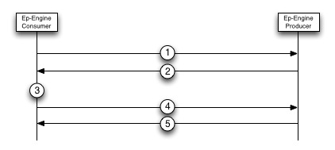
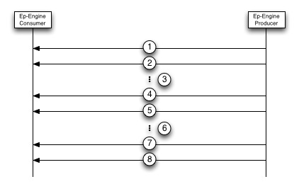

##UPR Session

This document intends to describe an example of an UPR session between a consumer and a producer. The intended readers of this document are consumers of the Couchbase Streaming API. In the sections below the server that is being communicated with is refered to as the "Producer" and the code code that is consuming the stream is refered to as the "Application". Please refer to the [Transport Specification](transport-spec.md) for more details on the wire format of each operation mentioned.

#####Creating the Connection

Creating a connection consists of opening a TCP/IP socket between the Application and the Producer and giving that connection a name. This must be done before any VBucket Streams can be created.

(1) The Application will send an Open Connection message to the Producer in order to create the initial connection and assign that connection a name. The connection name can be used for stat monitoring and other control messages during the lifetime of the connection. If a connection already exists on the Producer with the same name then that connection is closed and a new one is opened for the Application.

(2) The Producer will respond with a message containing a Connection UUID. This UUID is only needed if the Application needs to send a "Close Connection" control message to the Producer. For Application implmentations this UUID can be ignored.

#####Starting the Stream

Once a connection has been created the Application will want to create one or more VBucket Streams in order to get data out of Couchbase. The diagram below describes how to create a VBucket Stream.

(1) The Application will send a Start Stream message to the Producer. This message indicates that the Application wishes to receive data from the Producer on a specific VBucket. If this is the first time the Application is connecting to the Producer then 0 should be specified in the Sequence Number and VBucket UUID fields to indicate that the Application wants to receive all data from Couchbase from the begining of time. If it is not the first time the Application is connecting to the Producer then the Application should specify the Sequence Number from the last item the Application received as well as the last VBucket UUID the Application received. This will allow the Application to begin receiving data from where it last left off.

The Producer will respond to a Start Stream request with either an Ok message or a Rollback message. If the message is Rollback then the stream behavior will resume at step 2, but if an Ok message is received then jump to step 5.

(2) The Producer sends a Rollback response which contains  a Sequence Number/VBucket UUID pair that needs to be rolled back to. This means that the Application and the Producer have different version histories of their data and the Application needs to remove some of its data that the Producer doesn't have and then try to start the stream again.

(3) What happens in this step in totally up to the Application developer. Some Applications may not care if they have some stale data and others will.

(4) The Application then uses its new last Sequence Number and VBucket UUID and sends another Start Stream message to the Producer. The Sequence Number should be less than or equal to the Sequence number received in the Rollback message and the VBucket UUID should be the same as the one received in the Rollback message.

It is possible if there is a failover between steps 3 and 4 that the consumer will need to rollback again. This should be rare, but if it does happen then jump back to step 2.

(5) The Producer sends and Ok message which contains the Failover Log back to the Application. The Application should persist the Failover Log and expect to begin receiving data from the Producer.

Starting VBucket Streams can be parallelized and the Application can start as many streams as it needs to. Applications should not create a connection per VBucket Stream since this can cause heavy resource usage on the server.

#####Reading the Stream

Once a stream is started the Application will begin receiving data. The figure below shows what messages the Application should expect to receive. Fully understanding this section requires understanding what a [snapshot]() is and why snapshots are significant.

(1) The first data message and application will receive is a Stream Start message. The only significance of this message is to tell the Application that the data will begin being sent to the Application.

(2) The next message that will be received is a Start Snapshot message which will indicate that the starting of a snapshot.

(3) After a Start Snapshot message the Application will receive a series of Mutation, Deletion, and Expiration messages. These messages contain data about operations that have taken place on certain keys

(4) When the Producer gets to the end of a snaphot it sends a Snapshot End message to let the Application know that the snapshot is finished.

(5) If the Producer has more snapshots to send to the Application then the Producer will send a Snapshot Start message to let the client know it will be receiving another snapshot. 

(6) The Application will then receive all of the Mutation, Deletion, and Expiration messages in that snapshot.

(7) When the snapshot is finished the Producer will send a Snapshot End message.

(8) At some point the VBucket stream may then be finished and the Application will receive a Stream End message to signify the stream is finished. A stream may end for different reasons so it is important to check the status code in the Stream End message.

#####Closing a Stream

The Producer will close a stream whenever the Application responds with a NACK to a message sent by the Producer. If a message is sent to the Application for which the Application has no registered stream then this message should always be NACK'ed. As a result when closing a stream the Application can simply deregister the stream on the Application side. If the connection is still up then the next message sent by the Producer for that stream will be NACK'ed automatically and the Producer will then remove the stream from its side.

#####Closing a Connection

When closing an entire connection the Application can simply tear down the TCP/IP connection. This will cause the Producer to see that the connection is no longer active and the Producer will remove any structures used for sending data to the Application.